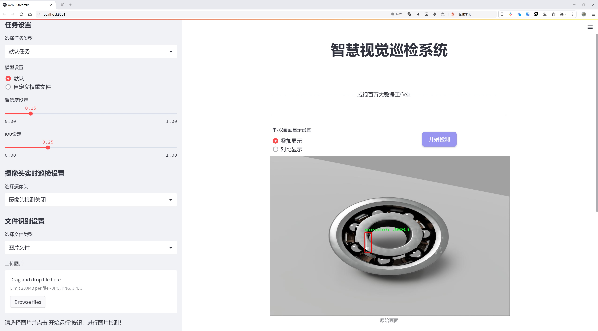
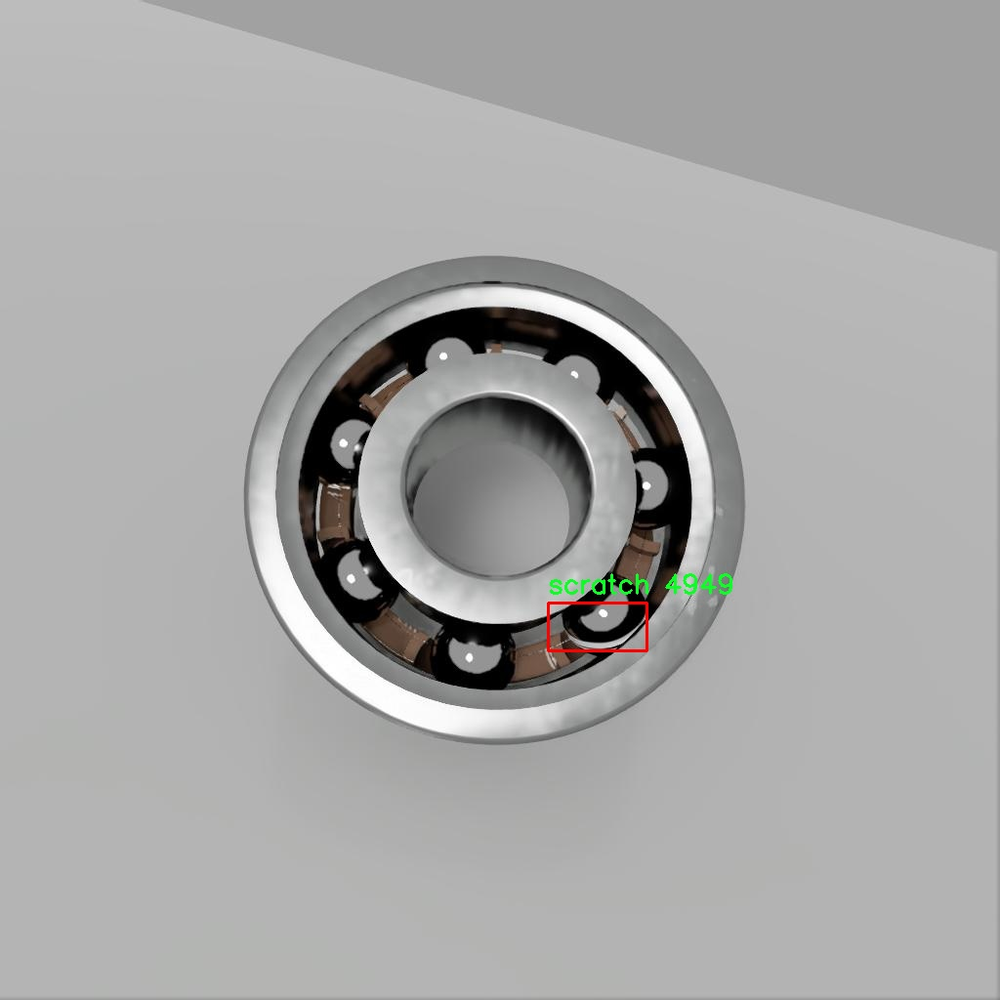

# 轴承缺陷检测系统源码分享
 # [一条龙教学YOLOV8标注好的数据集一键训练_70+全套改进创新点发刊_Web前端展示]

### 1.研究背景与意义

项目参考[AAAI Association for the Advancement of Artificial Intelligence](https://gitee.com/qunmasj/projects)

项目来源[AACV Association for the Advancement of Computer Vision](https://kdocs.cn/l/cszuIiCKVNis)

研究背景与意义

随着工业自动化和智能制造的迅速发展，机械设备的可靠性和安全性愈发受到重视。轴承作为机械设备中至关重要的组成部分，其运行状态直接影响到设备的整体性能和寿命。轴承缺陷的早期检测与诊断，不仅可以降低设备故障率，减少停机时间，还能有效降低维护成本，提升生产效率。因此，建立一个高效、准确的轴承缺陷检测系统显得尤为重要。

近年来，深度学习技术在计算机视觉领域取得了显著进展，尤其是在目标检测任务中，YOLO（You Only Look Once）系列模型因其高效性和实时性而受到广泛关注。YOLOv8作为该系列的最新版本，结合了更为先进的网络结构和优化算法，具备了更强的特征提取能力和更快的推理速度。基于YOLOv8的轴承缺陷检测系统，能够在复杂的工业环境中快速、准确地识别轴承的缺陷，具有重要的应用价值。

本研究将基于改进的YOLOv8模型，构建一个专门针对轴承缺陷检测的系统。我们将使用“BearingDefect v2”数据集，该数据集包含1200张图像，专注于一种缺陷类型——划痕。通过对这一特定缺陷的深入分析与学习，系统将能够有效识别和定位轴承表面的划痕缺陷，为后续的维护和检修提供可靠依据。

在数据集构建方面，虽然“BearingDefect v2”数据集的图像数量相对较少，但其专一性和针对性为模型的训练提供了良好的基础。通过对YOLOv8模型的改进与优化，我们将能够在有限的数据条件下，提升模型的检测精度和鲁棒性。此外，研究中将采用数据增强技术，以扩展训练样本的多样性，从而提高模型在实际应用中的适应能力。

本研究的意义不仅在于提升轴承缺陷检测的技术水平，更在于推动智能制造领域的进步。通过实现高效的缺陷检测，能够有效降低生产线上的人力成本，提高生产效率。同时，基于深度学习的检测系统也为其他工业设备的状态监测提供了借鉴，具有广泛的推广价值。

综上所述，基于改进YOLOv8的轴承缺陷检测系统的研究，不仅具有重要的理论意义，也具有显著的实际应用价值。随着智能制造的不断发展，轴承缺陷检测技术的进步将为整个工业领域的智能化转型提供有力支持。

### 2.图片演示




##### 注意：由于此博客编辑较早，上面“2.图片演示”和“3.视频演示”展示的系统图片或者视频可能为老版本，新版本在老版本的基础上升级如下：（实际效果以升级的新版本为准）

  （1）适配了YOLOV8的“目标检测”模型和“实例分割”模型，通过加载相应的权重（.pt）文件即可自适应加载模型。

  （2）支持“图片识别”、“视频识别”、“摄像头实时识别”三种识别模式。

  （3）支持“图片识别”、“视频识别”、“摄像头实时识别”三种识别结果保存导出，解决手动导出（容易卡顿出现爆内存）存在的问题，识别完自动保存结果并导出到tempDir中。

  （4）支持Web前端系统中的标题、背景图等自定义修改，后面提供修改教程。

  另外本项目提供训练的数据集和训练教程,暂不提供权重文件（best.pt）,需要您按照教程进行训练后实现图片演示和Web前端界面演示的效果。

### 3.视频演示

[3.1 视频演示](https://www.bilibili.com/video/BV1do1yYrECm/)

### 4.数据集信息展示

##### 4.1 本项目数据集详细数据（类别数＆类别名）

nc: 1
names: ['scratch']


##### 4.2 本项目数据集信息介绍

数据集信息展示

在现代工业中，轴承作为关键的机械部件，其性能直接影响到设备的运行效率和安全性。因此，针对轴承缺陷的检测与识别显得尤为重要。为此，我们构建了一个专门用于训练改进YOLOv8的轴承缺陷检测系统的数据集——“BearingDefect v2”。该数据集旨在为研究人员和工程师提供一个高质量的样本库，以便在实际应用中有效识别和分类轴承缺陷，进而提升设备的维护效率和可靠性。

“BearingDefect v2”数据集包含了丰富的轴承缺陷图像，专注于一种特定的缺陷类型，即“scratch”（划痕）。在数据集中，划痕作为轴承常见的缺陷之一，可能由多种因素引起，包括润滑不足、异物侵入、过载等。这种缺陷不仅会导致轴承的性能下降，还可能引发更严重的机械故障。因此，准确识别和定位划痕对于保障设备的正常运行至关重要。

该数据集的类别数量为1，专注于划痕的检测，这一单一类别的选择使得数据集在特定应用场景下具有更高的针对性和有效性。通过对大量包含划痕的轴承图像进行标注和整理，数据集为YOLOv8模型的训练提供了坚实的基础。数据集中每张图像都经过精心挑选，确保涵盖了不同角度、光照条件和背景下的划痕样本，以增强模型的泛化能力。

在数据集的构建过程中，我们采用了多种数据增强技术，以提高模型在实际应用中的鲁棒性。这些技术包括旋转、缩放、翻转和颜色调整等，旨在模拟真实环境中可能遇到的各种情况。通过这些增强处理，数据集不仅增加了样本的多样性，还有效提升了模型对划痕的识别能力。

此外，为了确保数据集的高质量和标注的准确性，我们邀请了多位领域专家参与数据的审核和标注工作。每个样本的划痕位置和类型都经过严格的验证，以确保训练过程中模型学习到的特征是可靠的。这种严谨的标注流程为后续的模型训练提供了坚实的基础，使得最终的检测系统能够在实际应用中表现出色。

“BearingDefect v2”数据集的发布，标志着轴承缺陷检测领域的一次重要进展。它不仅为研究人员提供了一个有效的工具，以推动相关技术的发展，还为工业界的实践应用提供了强有力的支持。随着数据集的不断完善和扩展，我们期待能够进一步提升YOLOv8在轴承缺陷检测中的性能，为设备的安全运行和维护提供更为精准的解决方案。通过这一数据集的应用，我们希望能够在未来的研究中实现更高效的缺陷检测，推动智能制造的进程。





### 5.全套项目环境部署视频教程（零基础手把手教学）

[5.1 环境部署教程链接（零基础手把手教学）](https://www.ixigua.com/7404473917358506534?logTag=c807d0cbc21c0ef59de5)


[5.2 安装Python虚拟环境创建和依赖库安装视频教程链接（零基础手把手教学）](https://www.ixigua.com/7404474678003106304?logTag=1f1041108cd1f708b01a)

### 6.手把手YOLOV8训练视频教程（零基础小白有手就能学会）

[6.1 手把手YOLOV8训练视频教程（零基础小白有手就能学会）](https://www.ixigua.com/7404477157818401292?logTag=d31a2dfd1983c9668658)


按照上面的训练视频教程链接加载项目提供的数据集，运行train.py即可开始训练



     Epoch   gpu_mem       box       obj       cls    labels  img_size
     1/200     20.8G   0.01576   0.01955  0.007536        22      1280: 100%|██████████| 849/849 [14:42<00:00,  1.04s/it]
               Class     Images     Labels          P          R     mAP@.5 mAP@.5:.95: 100%|██████████| 213/213 [01:14<00:00,  2.87it/s]
                 all       3395      17314      0.994      0.957      0.0957      0.0843

     Epoch   gpu_mem       box       obj       cls    labels  img_size
     2/200     20.8G   0.01578   0.01923  0.007006        22      1280: 100%|██████████| 849/849 [14:44<00:00,  1.04s/it]
               Class     Images     Labels          P          R     mAP@.5 mAP@.5:.95: 100%|██████████| 213/213 [01:12<00:00,  2.95it/s]
                 all       3395      17314      0.996      0.956      0.0957      0.0845

     Epoch   gpu_mem       box       obj       cls    labels  img_size
     3/200     20.8G   0.01561    0.0191  0.006895        27      1280: 100%|██████████| 849/849 [10:56<00:00,  1.29it/s]
               Class     Images     Labels          P          R     mAP@.5 mAP@.5:.95: 100%|███████   | 187/213 [00:52<00:00,  4.04it/s]
                 all       3395      17314      0.996      0.957      0.0957      0.0845


### 7.70+种全套YOLOV8创新点代码加载调参视频教程（一键加载写好的改进模型的配置文件）

[7.1 70+种全套YOLOV8创新点代码加载调参视频教程（一键加载写好的改进模型的配置文件）](https://www.ixigua.com/7404478314661806627?logTag=29066f8288e3f4eea3a4)

### 8.70+种全套YOLOV8创新点原理讲解（非科班也可以轻松写刊发刊，V10版本正在科研待更新）

#### 由于篇幅限制，每个创新点的具体原理讲解就不一一展开，具体见下列网址中的创新点对应子项目的技术原理博客网址【Blog】：


[8.1 70+种全套YOLOV8创新点原理讲解链接](https://gitee.com/qunmasj/good)

#### 部分改进原理讲解(完整的改进原理见上图和技术博客链接)
### YOLOv8简介
根据官方描述，Yolov8是一个SOTA模型，它建立在Yolo系列历史版本的基础上，并引入了新的功能和改进点，以进一步提升性能和灵活性，使其成为实现目标检测、图像分割、姿态估计等任务的最佳选择。其具体创新点包括一个新的骨干网络、一个新的Ancher-Free检测头和一个新的损失函数，可在CPU到GPU的多种硬件平台上运行。
此外，Yolov8还有一个特点就是可扩展性，ultralytics没有直接将开源库命名为Yolov8，而是直接使用"ultralytcs"，将其定位为算法框架，而非某一个特定算法。这也使得Yolov8开源库不仅仅能够用于Yolo系列模型，而且能够支持非Yolo模型以及分类分割姿态估计等各类任务。
总而言之，Yolov8是Yolo系列模型的最新王者，各种指标全面超越现有对象检测与实例分割模型，借鉴了Yolov5、Yolov6、YoloX等模型的设计优点，在全面提升改进Yolov5模型结构的基础上实现，同时保持了Yolov5工程化简洁易用的优势。

#### Yolov8创新点
Yolov8主要借鉴了Yolov5、Yolov6、YoloX等模型的设计优点，其本身创新点不多，偏重在工程实践上，具体创新如下:
·提供了一个全新的SOTA模型（包括P5 640和P6 1280分辨率的目标检测网络和基于YOLACT的实例分割模型)。并且，基于缩放系数提供了N/S/M/L/X不同尺度的模型，以满足不同部署平台和应用场景的需求。
. Backbone:同样借鉴了CSP模块思想，不过将Yolov5中的C3模块替换成了C2f模块
实现了进—步轻量化，同时沿用Yolov5中的
SPPF模块，并对不同尺度的模型进行精心微调，不再是无脑式一套参数用于所有模型，大幅提升了模型性能。
。Neck:继续使用PAN的思想，但是通过对比YOLOv5与YOLOv8的结构图可以看到，YOLOv8移除了1*1降采样层。
·Head部分相比YOLOv5改动较大，Yolov8换成了目前主流的解耦头结构(Decoupled-Head)，将分类和检测头分离，同时也从Anchor-Based换成了Anchor-Free。
·Loss计算:使用VFLLoss作为分类损失(实际训练中使用BCE Loss);使用DFLLoss+CIOU Loss作为回归损失。
。标签分配: Yolov8抛弃了以往的loU分配或者单边比例的分配方式，而是采用Task-Aligned Assigner正负样本分配策略。
#### Yolov8网络结构
Yolov8模型网络结构图如下图所示。


### Diverse Branch Block简介
参考该博客提出的一种通用的卷积网络构造块用来在不增加任何推理时间的前提下提升卷积网络的性能。我们将这个块命名为分离分支块（Diverse Branch Block）。通过结合不同尺寸和复杂度的分离分支（包括串联卷积、多尺度卷积和平均池化层）来增加特征空间的方法，它提升了单个卷积的表达能力。完成训练后，一个DBB(Diverse Branch Block)可以被等价地转换为一个单独的卷积操作以方便部署。不同于那些新颖的卷积结构的改进方式，DBB让训练时微结构复杂化同时维持大规模结构，因此我们可以将它作为任意结构中通用卷积层的一种嵌入式替代形式。通过这种方式，我们能够将模型训练到一个更高的表现水平，然后在推理时转换成原始推理时间的结构。

 
主要贡献点：

（1） 我们建议合并大量的微结构到不同的卷积结构中来提升性能，但是维持原始的宏观结构。

（2）我们提出DBB，一个通用构造块结构，概括六种转换来将一个DBB结构转化成一个单独卷积，因为对于用户来说它是无损的。

（3）我们提出一个Inception-like DBB结构实例(Fig 1)，并且展示它在ImageNet、COCO detection 和CityScapes任务中获得性能提升。


#### 结构重参数化
本文和一个并发网络RepVGG[1]是第一个使用结构重参数化来命名该思路------使用从其他结构转化来的参数确定当前结构的参数。一个之前的工作ACNet[2]也可以被划分为结构重参数化，它提出使用非对称卷积块来增强卷积核的结构（i.e 十字形结构）。相比于DBB，它被设计来提升卷积网络（在没有额外推理时间损失的条件下）。这个流水线也包含将一个训练好的模型转化为另一个。但是，ACNet和DBB的区别是：ACNet的思想被激发是基于一个观察，这个观察是网络结构的参数在过去有更大的量级，因此寻找方法让参数量级更大，然而我们关注一个不同的点。我们发现 平均池化、1x1 conv 和 1x1-kxk串联卷积是更有效的，因为它们提供了不同复杂度的路线，以及允许使用更多训练时非线性化。除此以外，ACB结构可以看作是DBB结构的一种特殊形式，因为那个1xk和kx1卷积层能够被扩大成kxk（via Transform VI(Fig.2)），然后合并成一个平方核（via Transform II）。

 

#### 分离分支结构
卷积的线性性
一个卷积操作可以表示为 ，其中为输入tensor, 为输出tensor。卷积核表示为一个四阶tensor , 偏置为。将加偏置的操作表示为。

因为，在第j个输出通道（h,w）位置的值可以由以下公式给出：，其中表示输入帧I的第c个通道上的一个滑动窗，对应输出帧O的坐标（h,w）。从上式可以看出，卷积操作具有齐次性和加法性。


注意：加法性成立的条件是两个卷积具有相同的配置（即通道数、核尺寸、步长和padding等）。

#### 分离分支的卷积
在这一小节，我们概括六种转换形式（Fig.2）来转换一个具有batch normalization(BN)、branch addition、depth concatenation、multi-scale operations、avarage pooling 和 sequences of convolutions的DBB分支。


Transform I：a conv for conv-BN  我们通常会给一个卷积配备配备一个BN层，它执行逐通道正则化和线性尺度放缩。设j为通道索引，分别为累积的逐通道均值和标准差，分别为学习的尺度因子和偏置项，对应输出通道j为


卷积的齐次性允许我们融合BN操作到前述的conv来做推理。在实践中，我们仅仅建立一个拥有卷积核和偏置, 用从原始BN序列的参数转换来的值来赋值。我们为每个输出通道j构造


Transform II a conv for branch addition  卷积的加法性确保如果有两个或者多个具有相同配置的卷积层相加，我们能够将它们合并到一个单独的卷积里面。对于conv-BN，我们应该首先执行Transform I。很明显的，通过下面的公式我们能够合并两个卷积


上述公式只有在两个卷积拥有相同配置时才成立。尽管合并上述分支能够在一定程度上增强模型，我们希望结合不同分支来进一步提升模型性能。在后面，我们介绍一些分支的形式，它们能够等价地被转化为一个单独的卷积。在通过多个转化来为每一个分支构造KxK的卷积之后，我们使用Transform II 将所有分支合并到一个conv里面。

Transform III: a conv for sequential convolutions   我们能够合并一个1x1 conv-BN-kxk conv序列到一个kxk conv里面。我们暂时假设卷积是稠密的（即 组数 groups=1）。组数groups>1的情形将会在Transform IV中实现。我们假定1x1和kxk卷积层的核形状分别是DxCx1x1和ExDxKxK，这里D指任意值。首先，我们将两个BN层融合到两个卷积层里面，由此获得。输出是


我们期望用一个单独卷积的核和偏置来表达，设, 它们满足。对方程（8）应用卷积的加法性，我们有


因为是一个1x1 conv，它只执行逐通道线性组合，没有空间聚合操作。通过线性重组KxK卷积核中的参数，我们能够将它合并到一个KxK的卷积核里面。容易证明的是，这样的转换可以由一个转置卷积实现：


其中是由转置获得的tensor张量。方程（10）的第二项是作用于常量矩阵上的卷积操作，因此它的输出也是一个常量矩阵。用表达式来说明，设是一个常数矩阵，其中的每个元素都等于p。*是一个2D 卷积操作，W为一个2D 卷积核。转换结果就是一个常量矩阵，这个常量矩阵是p 与 所有核元素之和 的乘积，即


基于以上观察，我们构造。然后，容易证明。

因此我们有

显而易见地，对于一个zero-pads 的KxK卷积，方程（8）并不成立，因为并不对的结果做卷积操作(如果有一个零元素的额外的圈，方程（8）成立)。解决方案有A)用padding配置第一个卷积，第二个卷积不用，B)通过做pad操作。后者的一个有效实现是定制第一个BN层，为了（1）如通常的batch-normalize输入。（2）计算(通过方程（6）)。（3）用  pad batch-normalized结果，例如 用一圈 pad 每一个通道j 。

Transform IV: a conv for depth concatenation  Inception 单元使用深度concatenation来组合不同分支。当每个分支都只包含一个相同配置的卷积时，深度concatenation等价于一个卷积，它的核在不同的输出通道上concatenation（比如我们公式中的第一个轴）假设。我们concatenate它们到。显然地


Transform IV 可以非常方便地将Transform III 扩展到 groupwise（即 groups > 1） 的情景。直觉上，一个groupwise 卷积将输入分割成g个并行的组，单独卷积它们，然后concatenate形成输出。为了代替g-group卷积，我们建立一个DBB结构，这个结构的所有卷积层有相同的组g。为了转换一个1x1-KxK序列，我们等价地分割它们成为g组，单独执行Transform III, 然后concatenate获得输出（如图Fig3所示）。


Transform V: a conv for average pooling  一个作用于C通道的核尺寸为K，步长为s的平均池化层等价于一个拥有相同核尺寸K,步长s的卷积层。这样的核可以被构造为

  


就像一个通常的平均池化操作，当s>1时执行降采样操作，当s=1时保持相同尺寸。

Transform VI: a conv for multi-scale convolutions   考虑一个等价于一个拥有相同zero padding的 核。特别地，卷积是格外实用的，因为它们能够有效实现。应该对输入作pad操作来对齐滑动窗。


### 9.系统功能展示（检测对象为举例，实际内容以本项目数据集为准）

图9.1.系统支持检测结果表格显示

  图9.2.系统支持置信度和IOU阈值手动调节

  图9.3.系统支持自定义加载权重文件best.pt(需要你通过步骤5中训练获得)

  图9.4.系统支持摄像头实时识别

  图9.5.系统支持图片识别

  图9.6.系统支持视频识别

  图9.7.系统支持识别结果文件自动保存

  图9.8.系统支持Excel导出检测结果数据


### 10.原始YOLOV8算法原理

原始YOLOv8算法原理

YOLO（You Only Look Once）系列算法自其诞生以来，便以其高效的目标检测能力而广受关注。YOLOv8作为该系列的最新版本，继承并发展了前几代算法的优点，同时引入了一系列创新，使其在目标检测领域的表现更加卓越。YOLOv8的设计理念是将目标检测任务视为一个回归问题，通过一个单一的神经网络模型同时预测目标的位置和类别，从而实现快速而准确的检测。

YOLOv8的网络结构主要由三个部分组成：主干网络（Backbone）、特征增强网络（Neck）和检测头（Head）。在主干网络中，YOLOv8继续采用CSP（Cross Stage Partial）结构，这种结构通过分割和重组特征图来提高模型的表达能力和计算效率。CSP结构的设计使得网络在提取特征时能够保持较低的计算成本，同时有效地捕捉到丰富的特征信息。

特征增强网络采用了PAN-FPN（Path Aggregation Network with Feature Pyramid Network）的思想，通过对不同尺度的特征图进行融合，增强了模型对多尺度目标的检测能力。PAN-FPN的设计理念在于通过上采样和下采样的方式，充分利用不同层次的特征信息，从而提升模型的整体性能。这种特征融合的策略使得YOLOv8在处理复杂场景时，能够更好地识别和定位目标。

在检测头部分，YOLOv8引入了解耦合头的概念，将分类和回归任务分离为两个独立的分支。这一创新使得模型在处理复杂场景时，能够更加专注于各自的任务，从而有效地减少了定位误差和分类错误的问题。通过解耦，YOLOv8能够在分类和回归过程中采用不同的策略和损失函数，从而进一步提升了检测精度。

与以往的YOLO系列相比，YOLOv8最大的创新之一是采用了Anchor-free目标检测方法。这种方法摒弃了传统的锚点框概念，直接通过回归方式预测目标的位置和大小。这一变化不仅简化了模型的设计，也提高了检测的灵活性和准确性。传统的锚点框方法在处理不同尺度和形状的目标时，往往需要预先定义多个锚点框，且调整过程繁琐。而YOLOv8的Anchor-free方法则通过让网络直接学习目标的边界框，能够更快地聚焦于目标位置的邻近点，使得预测框更接近于实际的边界框区域。

YOLOv8在训练过程中采用了一系列先进的数据增强技术，如Mosaic数据增强、自适应图片缩放和灰度填充等。这些技术不仅提高了模型的鲁棒性，还有效地扩展了训练数据的多样性，使得模型在面对不同场景时，能够保持良好的检测性能。此外，YOLOv8还引入了Task-Aligned Assigner方法，对分类分数和回归分数进行加权，从而实现更加精确的正样本匹配。

在损失计算方面，YOLOv8采用了BCE（Binary Cross-Entropy）作为分类损失，DFL（Distribution Focal Loss）和CIoU（Complete Intersection over Union）作为回归损失。这种损失函数的选择使得模型在训练过程中能够更好地平衡分类和回归任务，提高了模型的泛化能力和精准度。

尽管YOLOv8在多个方面取得了显著的进步，但在某些复杂环境下，如水面检测中，仍然存在小目标漏检和定位误差的问题。为了解决这些问题，研究者们提出了YOLOv8-WSSOD算法，通过引入BiFormer双层路由注意力机制和更小的检测头，进一步提升了网络对小目标的感知能力，并在Neck端引入GSConv和Slim-neck技术，以保持精度的同时降低计算量。这些改进使得YOLOv8在特定应用场景下的表现更加出色。

总的来说，YOLOv8通过一系列创新的设计和技术改进，提升了目标检测的速度和精度，尤其是在实时检测需求日益增长的背景下，其轻量化的模型结构使得YOLOv8能够在嵌入式设备上高效运行，满足了广泛应用场景的需求。随着YOLOv8的不断发展和优化，未来的目标检测技术将更加智能和高效，为各类应用提供更为强大的支持。


### 11.项目核心源码讲解（再也不用担心看不懂代码逻辑）

#### 11.1 ui.py

以下是对代码的核心部分进行提炼和详细注释的版本：

```python
import sys
import subprocess

def run_script(script_path):
    """
    使用当前 Python 环境运行指定的脚本。

    Args:
        script_path (str): 要运行的脚本路径

    Returns:
        None
    """
    # 获取当前 Python 解释器的路径
    python_path = sys.executable

    # 构建运行命令，使用 streamlit 运行指定的脚本
    command = f'"{python_path}" -m streamlit run "{script_path}"'

    # 执行命令并等待其完成
    result = subprocess.run(command, shell=True)
    
    # 检查命令执行结果，如果返回码不为0，则表示出错
    if result.returncode != 0:
        print("脚本运行出错。")

# 主程序入口
if __name__ == "__main__":
    # 指定要运行的脚本路径
    script_path = "web.py"  # 假设脚本在当前目录下

    # 调用函数运行指定的脚本
    run_script(script_path)
```

### 代码核心部分说明：

1. **导入模块**：
   - `sys`：用于获取当前 Python 解释器的路径。
   - `subprocess`：用于执行外部命令。

2. **`run_script` 函数**：
   - 该函数接受一个参数 `script_path`，表示要运行的 Python 脚本的路径。
   - 使用 `sys.executable` 获取当前 Python 解释器的路径，以确保使用正确的 Python 环境。
   - 构建一个命令字符串，该命令使用 `streamlit` 模块运行指定的脚本。
   - 使用 `subprocess.run` 执行构建的命令，并等待其完成。
   - 检查命令的返回码，如果返回码不为0，表示脚本运行出错，打印错误信息。

3. **主程序入口**：
   - 通过 `if __name__ == "__main__":` 确保该代码块仅在直接运行该脚本时执行。
   - 指定要运行的脚本路径（这里假设为 `web.py`）。
   - 调用 `run_script` 函数，传入脚本路径以执行该脚本。

这个程序文件名为 `ui.py`，其主要功能是通过当前的 Python 环境来运行一个指定的脚本。首先，文件中导入了几个必要的模块，包括 `sys`、`os` 和 `subprocess`，这些模块提供了与系统交互的功能。特别是 `subprocess` 模块用于在 Python 中执行外部命令。

接下来，定义了一个名为 `run_script` 的函数，该函数接受一个参数 `script_path`，表示要运行的脚本的路径。在函数内部，首先获取当前 Python 解释器的路径，使用 `sys.executable` 可以获取到当前运行的 Python 解释器的完整路径。然后，构建一个命令字符串，这个命令使用 `streamlit` 运行指定的脚本。`streamlit` 是一个用于构建数据应用的框架，`-m` 参数表示以模块的方式运行。

构建好命令后，使用 `subprocess.run` 来执行这个命令。`shell=True` 参数表示在 shell 中执行命令。执行完命令后，检查返回的结果码，如果结果码不为 0，说明脚本运行出错，程序会打印出相应的错误信息。

在文件的最后部分，使用 `if __name__ == "__main__":` 来判断当前模块是否是主程序。如果是主程序，则指定要运行的脚本路径，这里使用了 `abs_path("web.py")` 来获取 `web.py` 的绝对路径。然后调用 `run_script` 函数来运行这个脚本。

总体来说，这个程序的目的是提供一个简单的接口来运行一个 Streamlit 应用脚本，确保可以在当前的 Python 环境中顺利执行。

#### 11.2 code\ultralytics\data\explorer\explorer.py

以下是经过简化和注释的核心代码部分，主要集中在 `Explorer` 类及其方法上：

```python
# 导入必要的库
from pathlib import Path
from typing import Any, List, Union
import torch
from ultralytics.models.yolo.model import YOLO
from ultralytics.utils import LOGGER, checks
import lancedb

class Explorer:
    def __init__(self, data: Union[str, Path] = "coco128.yaml", model: str = "yolov8n.pt", uri: str = "~/ultralytics/explorer") -> None:
        # 检查所需的库是否安装
        checks.check_requirements(["lancedb>=0.4.3", "duckdb"])
        
        # 连接到 LanceDB 数据库
        self.connection = lancedb.connect(uri)
        self.table_name = Path(data).name.lower() + "_" + model.lower()  # 设置表名
        self.model = YOLO(model)  # 加载 YOLO 模型
        self.data = data  # 数据集路径
        self.table = None  # 数据表初始化为空
        self.progress = 0  # 进度初始化为0

    def create_embeddings_table(self, force: bool = False, split: str = "train") -> None:
        """
        创建包含数据集中图像嵌入的 LanceDB 表。如果表已存在，则重用它。
        参数:
            force (bool): 是否覆盖现有表。默认为 False。
            split (str): 使用的数据集分割。默认为 'train'。
        """
        # 检查表是否已存在
        if self.table is not None and not force:
            LOGGER.info("表已存在，重用它。传递 force=True 以覆盖。")
            return
        
        # 如果表名已存在，打开现有表
        if self.table_name in self.connection.table_names() and not force:
            LOGGER.info(f"表 {self.table_name} 已存在，重用它。传递 force=True 以覆盖。")
            self.table = self.connection.open_table(self.table_name)
            self.progress = 1
            return
        
        # 检查数据集是否提供
        if self.data is None:
            raise ValueError("必须提供数据以创建嵌入表")

        # 检查数据集信息
        data_info = check_det_dataset(self.data)
        if split not in data_info:
            raise ValueError(f"数据集中未找到分割 {split}。可用的键为 {list(data_info.keys())}")

        # 创建数据集
        choice_set = data_info[split]
        dataset = ExplorerDataset(img_path=choice_set, data=data_info, augment=False, cache=False, task=self.model.task)

        # 创建表模式并添加数据
        batch = dataset[0]
        vector_size = self.model.embed(batch["im_file"], verbose=False)[0].shape[0]
        table = self.connection.create_table(self.table_name, schema=get_table_schema(vector_size), mode="overwrite")
        table.add(self._yield_batches(dataset, data_info, self.model))
        self.table = table  # 更新表属性

    def _yield_batches(self, dataset: ExplorerDataset, data_info: dict, model: YOLO):
        """生成数据批次以进行嵌入。"""
        for i in range(len(dataset)):
            self.progress = float(i + 1) / len(dataset)  # 更新进度
            batch = dataset[i]
            batch["vector"] = model.embed(batch["im_file"], verbose=False)[0].detach().tolist()  # 计算嵌入向量
            yield [batch]  # 生成批次

    def query(self, imgs: Union[str, List[str]] = None, limit: int = 25) -> Any:
        """
        查询表以获取相似图像。接受单个图像或图像列表。
        参数:
            imgs (str or list): 图像路径或图像路径列表。
            limit (int): 返回的结果数量。
        返回:
            (pyarrow.Table): 包含结果的箭头表。
        """
        if self.table is None:
            raise ValueError("表未创建。请先创建表。")
        
        if isinstance(imgs, str):
            imgs = [imgs]  # 将单个图像转换为列表
        
        embeds = self.model.embed(imgs)  # 计算图像嵌入
        embeds = torch.mean(torch.stack(embeds), 0).cpu().numpy() if len(embeds) > 1 else embeds[0].cpu().numpy()
        return self.table.search(embeds).limit(limit).to_arrow()  # 查询相似图像并返回结果

    def sql_query(self, query: str, return_type: str = "pandas") -> Union[DataFrame, Any, None]:
        """
        在表上运行 SQL 查询。
        参数:
            query (str): 要运行的 SQL 查询。
            return_type (str): 返回结果的类型，可以是 'pandas' 或 'arrow'。
        返回:
            (pyarrow.Table): 包含结果的箭头表。
        """
        if self.table is None:
            raise ValueError("表未创建。请先创建表。")
        
        # 确保查询以 SELECT 或 WHERE 开头
        if not query.startswith("SELECT") and not query.startswith("WHERE"):
            raise ValueError(f"查询必须以 SELECT 或 WHERE 开头。找到 {query}")
        
        if query.startswith("WHERE"):
            query = f"SELECT * FROM 'table' {query}"  # 添加 SELECT 前缀
        
        LOGGER.info(f"运行查询: {query}")
        rs = duckdb.sql(query)  # 使用 DuckDB 执行查询
        
        return rs.df() if return_type == "pandas" else rs.arrow()  # 根据返回类型返回结果

    def get_similar(self, img: Union[str, List[str]] = None, limit: int = 25, return_type: str = "pandas") -> Union[DataFrame, Any]:
        """
        查询表以获取相似图像。
        参数:
            img (str or list): 图像路径或图像路径列表。
            limit (int): 返回的结果数量。默认为 25。
            return_type (str): 返回结果的类型，可以是 'pandas' 或 'arrow'。
        返回:
            (pandas.DataFrame): 包含结果的数据框。
        """
        img = self._check_imgs_or_idxs(img)
        similar = self.query(img, limit=limit)  # 查询相似图像

        return similar.to_pandas() if return_type == "pandas" else similar  # 根据返回类型返回结果

    def _check_imgs_or_idxs(self, img: Union[str, List[str]], idx: Union[None, int, List[int]]) -> List[str]:
        """检查提供的图像或索引是否有效。"""
        if img is None and idx is None:
            raise ValueError("必须提供 img 或 idx 之一。")
        
        if idx is not None:
            idx = idx if isinstance(idx, list) else [idx]
            img = self.table.to_lance().take(idx, columns=["im_file"]).to_pydict()["im_file"]  # 根据索引获取图像
        
        return img if isinstance(img, list) else [img]  # 确保返回列表
```

### 代码说明：
1. **导入模块**：导入必要的库和模块以支持数据处理和模型操作。
2. **Explorer 类**：该类用于处理图像数据集的查询和嵌入生成。
3. **构造函数**：初始化数据库连接、模型和数据集路径。
4. **create_embeddings_table 方法**：创建一个包含图像嵌入的数据库表，支持重用和覆盖。
5. **_yield_batches 方法**：生成图像批次并计算其嵌入向量。
6. **query 方法**：根据输入图像查询相似图像。
7. **sql_query 方法**：在数据库表上执行 SQL 查询。
8. **get_similar 方法**：获取与输入图像相似的图像。
9. **_check_imgs_or_idxs 方法**：验证输入的图像或索引是否有效。

通过这些方法，用户可以方便地创建图像嵌入、查询相似图像以及执行 SQL 查询。

这个程序文件 `explorer.py` 是 Ultralytics YOLO 项目的一部分，主要用于处理和探索图像数据集。它定义了两个主要的类：`ExplorerDataset` 和 `Explorer`，并提供了一系列方法来加载图像、创建嵌入表、查询相似图像、执行 SQL 查询以及可视化结果。

`ExplorerDataset` 类继承自 `YOLODataset`，主要负责加载图像数据。它的 `load_image` 方法可以根据索引加载单张图像，并返回图像的原始尺寸和当前尺寸。如果图像未缓存在内存中，它会尝试从文件系统读取图像或加载 `.npy` 文件。`build_transforms` 方法则创建图像的转换操作，主要用于数据增强。

`Explorer` 类是整个数据探索的核心，初始化时需要指定数据集的路径、模型文件和数据库的 URI。它会检查所需的库是否安装，并建立与 LanceDB 的连接。该类的 `create_embeddings_table` 方法用于创建一个包含图像嵌入的数据库表。如果表已经存在，可以选择覆盖它。该方法首先检查数据集的有效性，然后通过 `ExplorerDataset` 加载数据，生成图像的嵌入并将其存储在数据库中。

`query` 方法允许用户根据输入的图像查询相似的图像，并返回查询结果。`sql_query` 方法则支持执行 SQL 风格的查询，用户可以根据条件筛选数据。`plot_sql_query` 方法可以将 SQL 查询的结果可视化，返回一个图像对象。

此外，`get_similar` 和 `plot_similar` 方法提供了获取和可视化相似图像的功能。`similarity_index` 方法计算所有图像的相似性索引，并返回一个包含相似图像及其距离的数据框。`plot_similarity_index` 方法则可视化相似性索引的结果。

该类还提供了 `ask_ai` 方法，允许用户通过自然语言查询图像数据集，系统会生成相应的 SQL 查询并返回结果。最后，`visualize` 和 `generate_report` 方法预留了可视化和报告生成的功能，但尚未实现。

整体而言，这个文件提供了一整套用于图像数据集探索和分析的工具，结合了深度学习模型的嵌入能力和数据库的查询功能，适合需要处理大量图像数据的应用场景。

#### 11.3 code\ultralytics\models\yolo\classify\__init__.py

```python
# 导入Ultralytics YOLO库中的分类模块
# Ultralytics YOLO 🚀, AGPL-3.0 许可证

# 从yolo分类模块中导入预测、训练和验证的类
from ultralytics.models.yolo.classify.predict import ClassificationPredictor  # 导入分类预测器
from ultralytics.models.yolo.classify.train import ClassificationTrainer      # 导入分类训练器
from ultralytics.models.yolo.classify.val import ClassificationValidator      # 导入分类验证器

# 定义模块的公开接口，包含三个核心类
__all__ = "ClassificationPredictor", "ClassificationTrainer", "ClassificationValidator"
```

### 代码核心部分说明：
1. **导入模块**：
   - 该代码段主要用于导入Ultralytics YOLO库中的分类相关功能，包括预测、训练和验证。这些功能是进行图像分类任务的基础。

2. **核心类**：
   - `ClassificationPredictor`：用于进行图像分类的预测，输入图像后可以输出其分类结果。
   - `ClassificationTrainer`：用于训练分类模型，通过提供训练数据来优化模型参数。
   - `ClassificationValidator`：用于验证分类模型的性能，通常在训练后使用，以评估模型在未见数据上的表现。

3. **`__all__`**：
   - 该变量定义了模块的公开接口，只有在使用`from module import *`时，才会导入这些指定的类。这是一种控制模块可见性的方式。

这个程序文件是Ultralytics YOLO模型库中的一个初始化文件，文件名为`__init__.py`，它的主要作用是定义该模块的公共接口。

首先，文件开头有一行注释，标明了这是Ultralytics YOLO项目的一部分，并且使用了AGPL-3.0许可证。这表明该代码是开源的，并且使用了特定的许可证条款。

接下来，文件中导入了三个类：`ClassificationPredictor`、`ClassificationTrainer`和`ClassificationValidator`。这些类分别负责分类任务中的预测、训练和验证功能。具体来说：

- `ClassificationPredictor`：这个类用于进行分类预测，可能会包含一些方法来加载模型并对输入数据进行分类。
- `ClassificationTrainer`：这个类负责训练分类模型，通常会包含训练过程中的数据处理、模型更新和评估等功能。
- `ClassificationValidator`：这个类用于验证训练好的模型的性能，通常会在验证集上评估模型的准确性和其他指标。

最后，`__all__`变量定义了模块的公共接口，列出了可以被外部导入的类名。这意味着当用户使用`from ultralytics.models.yolo.classify import *`时，只会导入`ClassificationPredictor`、`ClassificationTrainer`和`ClassificationValidator`这三个类，其他未列出的内容将不会被导入。

总的来说，这个文件的主要功能是组织和暴露与YOLO分类相关的功能模块，使得用户能够方便地使用这些功能。

#### 11.4 70+种YOLOv8算法改进源码大全和调试加载训练教程（非必要）\ultralytics\models\yolo\pose\__init__.py

以下是经过简化并添加详细中文注释的核心代码部分：

```python
# 导入所需的模块
from .predict import PosePredictor  # 导入姿态预测器类
from .train import PoseTrainer      # 导入姿态训练器类
from .val import PoseValidator       # 导入姿态验证器类

# 定义模块的公开接口，指定可以被外部访问的类
__all__ = 'PoseTrainer', 'PoseValidator', 'PosePredictor'
```

### 代码详细注释：

1. **导入模块**：
   - `from .predict import PosePredictor`：从当前包的 `predict` 模块中导入 `PosePredictor` 类，该类用于进行姿态预测。
   - `from .train import PoseTrainer`：从当前包的 `train` 模块中导入 `PoseTrainer` 类，该类用于训练姿态模型。
   - `from .val import PoseValidator`：从当前包的 `val` 模块中导入 `PoseValidator` 类，该类用于验证姿态模型的性能。

2. **定义公开接口**：
   - `__all__` 是一个特殊变量，用于定义模块的公共接口。它指定了当使用 `from module import *` 语句时，哪些名称是可以被导入的。在这里，只有 `PoseTrainer`、`PoseValidator` 和 `PosePredictor` 这三个类可以被外部访问。

这个文件是一个Python模块的初始化文件，属于Ultralytics YOLO（You Only Look Once）系列的代码库，专注于姿态估计（Pose Estimation）相关的功能。文件中包含了三个主要的类或功能模块：PosePredictor、PoseTrainer和PoseValidator。

首先，文件的开头有一个注释，指出这是Ultralytics YOLO的代码，并且遵循AGPL-3.0许可证。这意味着该代码是开源的，用户可以自由使用和修改，但需要遵循相应的许可证条款。

接下来，文件通过相对导入的方式引入了三个模块：
- **PosePredictor**：这个模块负责姿态预测，可能包含了用于从图像中识别和定位人体关键点的算法和方法。
- **PoseTrainer**：这个模块用于训练姿态估计模型，可能包括模型的构建、训练过程的管理以及损失函数的计算等功能。
- **PoseValidator**：这个模块用于验证训练好的模型，通常涉及到在验证集上评估模型的性能，计算准确率、召回率等指标。

最后，`__all__`变量定义了当使用`from module import *`语句时，哪些名称会被导入。在这里，它指定了三个类：PoseTrainer、PoseValidator和PosePredictor。这意味着这些类是该模块的公共接口，用户可以直接使用它们，而不需要知道模块内部的实现细节。

总的来说，这个初始化文件的主要作用是组织和暴露与姿态估计相关的功能模块，方便用户进行模型的训练、预测和验证。

#### 11.5 train.py

以下是经过简化和注释的核心代码部分，主要集中在YOLO检测模型的训练过程：

```python
import random
import numpy as np
import torch.nn as nn
from ultralytics.data import build_dataloader, build_yolo_dataset
from ultralytics.engine.trainer import BaseTrainer
from ultralytics.models import yolo
from ultralytics.nn.tasks import DetectionModel
from ultralytics.utils import LOGGER, RANK
from ultralytics.utils.torch_utils import de_parallel, torch_distributed_zero_first

class DetectionTrainer(BaseTrainer):
    """
    基于检测模型的训练类，继承自BaseTrainer类。
    """

    def build_dataset(self, img_path, mode="train", batch=None):
        """
        构建YOLO数据集。

        参数:
            img_path (str): 包含图像的文件夹路径。
            mode (str): 模式，`train`表示训练模式，`val`表示验证模式。
            batch (int, optional): 批次大小，默认为None。
        """
        gs = max(int(de_parallel(self.model).stride.max() if self.model else 0), 32)  # 获取模型的最大步幅
        return build_yolo_dataset(self.args, img_path, batch, self.data, mode=mode, rect=mode == "val", stride=gs)

    def get_dataloader(self, dataset_path, batch_size=16, rank=0, mode="train"):
        """构建并返回数据加载器。"""
        assert mode in ["train", "val"]  # 确保模式有效
        with torch_distributed_zero_first(rank):  # 在分布式训练中，确保数据集只初始化一次
            dataset = self.build_dataset(dataset_path, mode, batch_size)
        shuffle = mode == "train"  # 训练模式下打乱数据
        workers = self.args.workers if mode == "train" else self.args.workers * 2  # 设置工作线程数
        return build_dataloader(dataset, batch_size, workers, shuffle, rank)  # 返回数据加载器

    def preprocess_batch(self, batch):
        """对图像批次进行预处理，包括缩放和转换为浮点数。"""
        batch["img"] = batch["img"].to(self.device, non_blocking=True).float() / 255  # 转换为浮点数并归一化
        if self.args.multi_scale:  # 如果启用多尺度
            imgs = batch["img"]
            sz = (
                random.randrange(self.args.imgsz * 0.5, self.args.imgsz * 1.5 + self.stride)
                // self.stride
                * self.stride
            )  # 随机选择图像大小
            sf = sz / max(imgs.shape[2:])  # 计算缩放因子
            if sf != 1:
                ns = [
                    math.ceil(x * sf / self.stride) * self.stride for x in imgs.shape[2:]
                ]  # 计算新的图像形状
                imgs = nn.functional.interpolate(imgs, size=ns, mode="bilinear", align_corners=False)  # 进行插值缩放
            batch["img"] = imgs
        return batch

    def get_model(self, cfg=None, weights=None, verbose=True):
        """返回YOLO检测模型。"""
        model = DetectionModel(cfg, nc=self.data["nc"], verbose=verbose and RANK == -1)  # 创建检测模型
        if weights:
            model.load(weights)  # 加载预训练权重
        return model

    def plot_training_samples(self, batch, ni):
        """绘制训练样本及其注释。"""
        plot_images(
            images=batch["img"],
            batch_idx=batch["batch_idx"],
            cls=batch["cls"].squeeze(-1),
            bboxes=batch["bboxes"],
            paths=batch["im_file"],
            fname=self.save_dir / f"train_batch{ni}.jpg",
            on_plot=self.on_plot,
        )

    def plot_metrics(self):
        """从CSV文件中绘制指标。"""
        plot_results(file=self.csv, on_plot=self.on_plot)  # 保存结果图
```

### 代码注释说明：
1. **构建数据集**：`build_dataset`方法负责根据输入的图像路径和模式（训练或验证）构建YOLO数据集。
2. **获取数据加载器**：`get_dataloader`方法用于创建数据加载器，支持分布式训练。
3. **预处理批次**：`preprocess_batch`方法对输入的图像批次进行预处理，包括归一化和多尺度调整。
4. **获取模型**：`get_model`方法用于实例化YOLO检测模型，并可选择加载预训练权重。
5. **绘制训练样本**：`plot_training_samples`方法用于可视化训练样本及其对应的标签。
6. **绘制指标**：`plot_metrics`方法用于从CSV文件中绘制训练过程中的指标。 

这些方法构成了YOLO模型训练的核心逻辑，涵盖了数据处理、模型构建和结果可视化等关键步骤。

这个程序文件 `train.py` 是一个用于训练 YOLO（You Only Look Once）目标检测模型的脚本，继承自 `BaseTrainer` 类。文件中包含了多个方法，用于构建数据集、获取数据加载器、预处理图像批次、设置模型属性、获取模型、进行验证、记录损失、显示训练进度、绘制训练样本和绘制训练指标等。

首先，`DetectionTrainer` 类通过 `build_dataset` 方法构建 YOLO 数据集。该方法接收图像路径、模式（训练或验证）和批次大小作为参数，使用 `build_yolo_dataset` 函数生成数据集。数据集的构建考虑了模型的步幅，以确保输入图像的尺寸与模型兼容。

接下来，`get_dataloader` 方法用于构建数据加载器，支持分布式训练。它会根据模式（训练或验证）选择是否打乱数据，并设置工作线程的数量。通过调用 `build_dataloader` 函数返回数据加载器。

在处理图像批次时，`preprocess_batch` 方法负责将图像缩放并转换为浮点数格式。该方法还支持多尺度训练，通过随机选择图像尺寸并进行插值处理，以增强模型的鲁棒性。

`set_model_attributes` 方法用于设置模型的属性，包括类别数量和类别名称，以确保模型能够正确识别数据集中的目标。

`get_model` 方法返回一个 YOLO 检测模型，并可以加载预训练权重。`get_validator` 方法则返回一个用于验证模型性能的 `DetectionValidator` 实例，能够计算损失并进行评估。

在训练过程中，`label_loss_items` 方法用于记录和返回训练损失项的字典，方便后续的监控和分析。`progress_string` 方法格式化并返回训练进度的字符串，包括当前的 epoch、GPU 内存使用情况、损失值、实例数量和图像尺寸等信息。

此外，`plot_training_samples` 方法用于绘制训练样本及其标注，便于可视化训练过程中的数据情况。最后，`plot_metrics` 和 `plot_training_labels` 方法分别用于绘制训练过程中的指标和标签，以便分析模型的训练效果。

总体而言，这个程序文件提供了一个完整的框架，用于训练 YOLO 模型，涵盖了数据处理、模型构建、训练监控和结果可视化等多个方面。

#### 11.6 70+种YOLOv8算法改进源码大全和调试加载训练教程（非必要）\ultralytics\models\sam\modules\transformer.py

以下是经过简化并添加详细中文注释的核心代码部分：

```python
import math
import torch
from torch import Tensor, nn

class Attention(nn.Module):
    """注意力层，允许在投影到查询、键和值后对嵌入的大小进行下采样。"""

    def __init__(self, embedding_dim: int, num_heads: int, downsample_rate: int = 1) -> None:
        """
        初始化注意力模型，设置维度和参数。

        Args:
            embedding_dim (int): 输入嵌入的维度。
            num_heads (int): 注意力头的数量。
            downsample_rate (int, optional): 内部维度下采样的因子，默认为1。
        """
        super().__init__()
        self.embedding_dim = embedding_dim
        self.internal_dim = embedding_dim // downsample_rate  # 内部维度
        self.num_heads = num_heads
        assert self.internal_dim % num_heads == 0, 'num_heads必须整除embedding_dim.'

        # 定义线性层用于查询、键和值的投影
        self.q_proj = nn.Linear(embedding_dim, self.internal_dim)
        self.k_proj = nn.Linear(embedding_dim, self.internal_dim)
        self.v_proj = nn.Linear(embedding_dim, self.internal_dim)
        self.out_proj = nn.Linear(self.internal_dim, embedding_dim)  # 输出投影

    @staticmethod
    def _separate_heads(x: Tensor, num_heads: int) -> Tensor:
        """将输入张量分离成指定数量的注意力头。"""
        b, n, c = x.shape  # b: 批量大小, n: token数量, c: 特征维度
        x = x.reshape(b, n, num_heads, c // num_heads)  # 重塑为 B x N x N_heads x C_per_head
        return x.transpose(1, 2)  # 转置为 B x N_heads x N_tokens x C_per_head

    @staticmethod
    def _recombine_heads(x: Tensor) -> Tensor:
        """将分离的注意力头重新组合成一个张量。"""
        b, n_heads, n_tokens, c_per_head = x.shape
        x = x.transpose(1, 2)  # 转置为 B x N_tokens x N_heads x C_per_head
        return x.reshape(b, n_tokens, n_heads * c_per_head)  # 重塑为 B x N_tokens x C

    def forward(self, q: Tensor, k: Tensor, v: Tensor) -> Tensor:
        """计算给定输入查询、键和值张量的注意力输出。"""

        # 输入投影
        q = self.q_proj(q)  # 投影查询
        k = self.k_proj(k)  # 投影键
        v = self.v_proj(v)  # 投影值

        # 分离成多个头
        q = self._separate_heads(q, self.num_heads)
        k = self._separate_heads(k, self.num_heads)
        v = self._separate_heads(v, self.num_heads)

        # 计算注意力
        _, _, _, c_per_head = q.shape
        attn = q @ k.permute(0, 1, 3, 2)  # 计算注意力得分
        attn = attn / math.sqrt(c_per_head)  # 缩放
        attn = torch.softmax(attn, dim=-1)  # 归一化为概率

        # 获取输出
        out = attn @ v  # 加权求和
        out = self._recombine_heads(out)  # 重新组合头
        return self.out_proj(out)  # 输出投影
```

### 代码核心部分说明：
1. **Attention类**：实现了一个注意力机制，支持对输入的查询、键和值进行线性投影，并计算注意力输出。
2. **初始化方法**：设置嵌入维度、注意力头数量和下采样率，并定义了相应的线性层。
3. **_separate_heads方法**：将输入张量分离为多个注意力头，便于并行计算。
4. **_recombine_heads方法**：将分离的注意力头重新组合为一个张量，以便后续处理。
5. **forward方法**：实现了注意力计算的核心逻辑，包括输入投影、注意力得分计算、归一化和输出生成。

这个程序文件定义了一个名为 `TwoWayTransformer` 的类，主要用于实现一个双向变换器（Transformer）模块，能够同时关注图像和查询点。该模块特别适用于物体检测、图像分割和点云处理等任务。

在 `TwoWayTransformer` 类的构造函数中，初始化了一些重要的参数，包括变换器的层数（`depth`）、输入嵌入的通道维度（`embedding_dim`）、多头注意力的头数（`num_heads`）、MLP块的内部通道维度（`mlp_dim`）等。接着，使用 `nn.ModuleList` 创建了多个 `TwoWayAttentionBlock` 层，这些层将组成变换器的主体结构。最后，定义了一个最终的注意力层和一个层归一化层，用于处理查询和图像之间的最终交互。

在 `forward` 方法中，输入的图像嵌入、图像的位置信息编码（`image_pe`）和查询点的嵌入被处理。首先，将图像嵌入和位置信息编码展平并调整维度，以便进行后续的注意力计算。然后，逐层应用之前定义的注意力块，并在每层中更新查询和键的嵌入。最后，使用最终的注意力层对查询和图像进行交互，并进行层归一化，返回处理后的查询和键。

`TwoWayAttentionBlock` 类实现了一个注意力块，包含自注意力和交叉注意力的功能。该类的构造函数定义了多个层，包括自注意力层、交叉注意力层、MLP块以及相应的层归一化。`forward` 方法中，首先对查询进行自注意力计算，然后进行交叉注意力计算，接着通过 MLP 块处理查询，最后再进行一次交叉注意力计算，返回更新后的查询和键。

`Attention` 类实现了一个注意力层，支持在投影到查询、键和值之后对嵌入进行下采样。构造函数中定义了输入嵌入的维度、注意力头的数量以及下采样率。`forward` 方法中，首先对输入的查询、键和值进行线性投影，然后将它们分离成多个注意力头，计算注意力权重，并将结果重新组合成一个输出。

整体而言，这个文件实现了一个复杂的双向变换器结构，能够高效地处理图像和查询点之间的关系，为各种计算机视觉任务提供支持。

### 12.系统整体结构（节选）

### 整体功能和构架概括

该项目是一个基于YOLO（You Only Look Once）算法的计算机视觉框架，主要用于目标检测、姿态估计、图像分类和其他相关任务。项目结构模块化，包含多个子模块，每个模块负责特定的功能，如数据处理、模型训练、推理、可视化等。以下是各个模块的主要功能：

- **UI模块**：提供用户界面功能，允许用户通过命令行运行特定的脚本。
- **数据处理模块**：用于加载和处理数据集，支持数据增强和转换。
- **模型模块**：定义和实现YOLO模型的各个变体，包括分类和姿态估计。
- **训练模块**：负责模型的训练过程，包括数据加载、损失计算和训练监控。
- **变换器模块**：实现了双向变换器结构，处理图像和查询点之间的关系。

### 文件功能整理表

| 文件路径                                                                                              | 功能描述                                                                                     |
|------------------------------------------------------------------------------------------------------|---------------------------------------------------------------------------------------------|
| `C:\shangjia\code\ui.py`                                                                            | 提供用户界面功能，通过命令行运行指定的Streamlit脚本。                                       |
| `C:\shangjia\code\code\ultralytics\data\explorer\explorer.py`                                     | 处理和探索图像数据集，提供数据加载、嵌入生成、相似图像查询和可视化功能。                   |
| `C:\shangjia\code\code\ultralytics\models\yolo\classify\__init__.py`                             | 定义与YOLO分类相关的功能模块，包括分类预测、训练和验证。                                   |
| `C:\shangjia\code\70+种YOLOv8算法改进源码大全和调试加载训练教程（非必要）\ultralytics\models\yolo\pose\__init__.py` | 定义与YOLO姿态估计相关的功能模块，包括姿态预测、训练和验证。                               |
| `C:\shangjia\code\train.py`                                                                         | 提供YOLO模型的训练框架，包括数据处理、模型构建、训练监控和结果可视化。                     |
| `C:\shangjia\code\70+种YOLOv8算法改进源码大全和调试加载训练教程（非必要）\ultralytics\models\sam\modules\transformer.py` | 实现双向变换器结构，处理图像和查询点之间的关系，适用于多种计算机视觉任务。                  |
| `C:\shangjia\code\70+种YOLOv8算法改进源码大全和调试加载训练教程（非必要）\ultralytics\models\utils\ops.py` | 提供各种操作和工具函数，支持模型训练和推理过程中的计算。                                   |
| `C:\shangjia\code\code\ultralytics\solutions\speed_estimation.py`                                   | 实现速度估计功能，可能用于实时目标检测和跟踪应用。                                         |
| `C:\shangjia\code\70+种YOLOv8算法改进源码大全和调试加载训练教程（非必要）\ultralytics\models\nas\predict.py` | 实现神经架构搜索（NAS）相关的预测功能，优化模型结构。                                     |
| `C:\shangjia\code\70+种YOLOv8算法改进源码大全和调试加载训练教程（非必要）\ultralytics\utils\callbacks\wb.py` | 提供与Weights & Biases集成的回调功能，用于监控和记录训练过程。                           |
| `C:\shangjia\code\code\ultralytics\nn\modules\__init__.py`                                        | 初始化神经网络模块，组织和暴露相关的功能。                                               |
| `C:\shangjia\code\ultralytics\utils\downloads.py`                                                  | 提供下载功能，支持从外部源获取数据集和模型权重。                                          |
| `C:\shangjia\code\70+种YOLOv8算法改进源码大全和调试加载训练教程（非必要）\ultralytics\models\sam\modules\__init__.py` | 初始化SAM（Segment Anything Model）模块，组织和暴露相关功能。                           |

以上表格整理了每个文件的功能，便于理解整个项目的结构和各个模块的职责。

注意：由于此博客编辑较早，上面“11.项目核心源码讲解（再也不用担心看不懂代码逻辑）”中部分代码可能会优化升级，仅供参考学习，完整“训练源码”、“Web前端界面”和“70+种创新点源码”以“13.完整训练+Web前端界面+70+种创新点源码、数据集获取”的内容为准。

### 13.完整训练+Web前端界面+70+种创新点源码、数据集获取


# [下载链接：F:\Temporary](F:\Temporary)